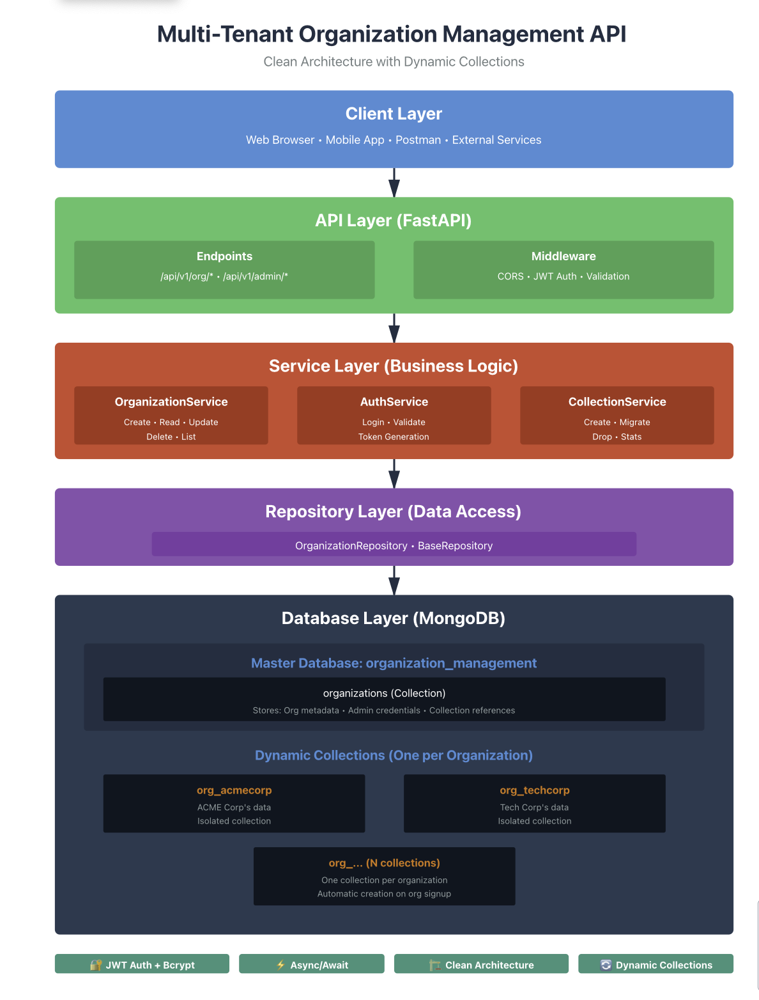
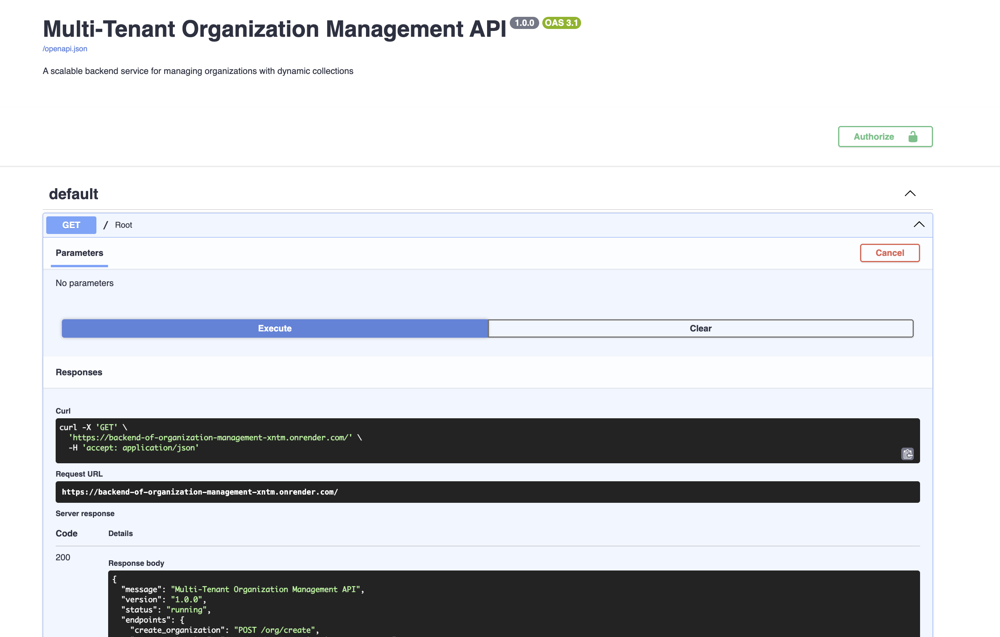
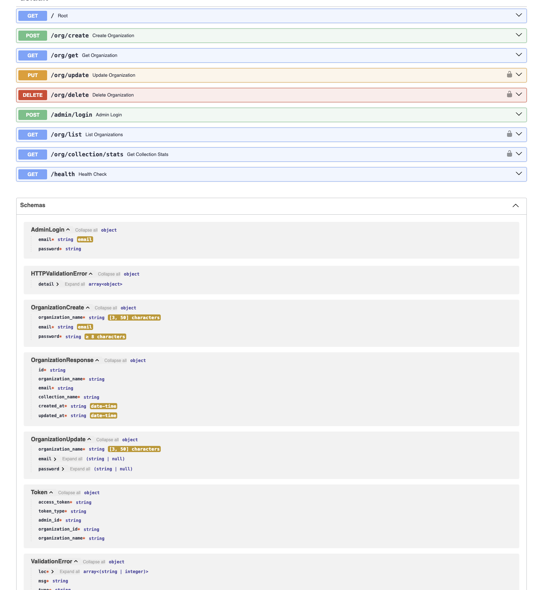
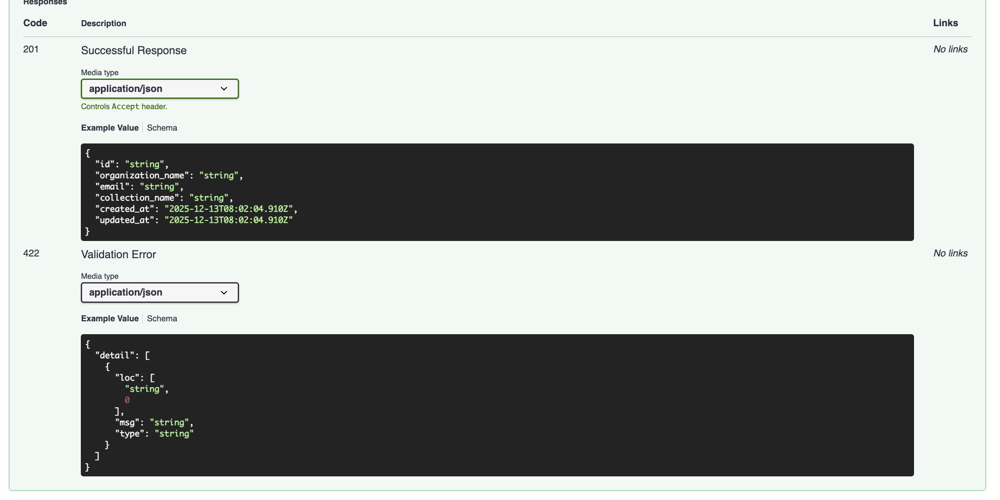
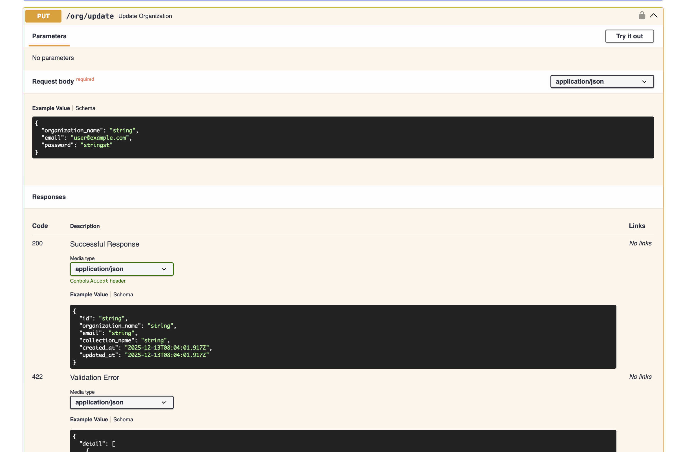

# Backend_of_Organization-Management-Service

Multi-Tenant Organization Management Backend
A scalable FastAPI backend designed to manage organizations using a multi-tenant architecture. The system maintains a master database for global metadata and dynamically creates isolated MongoDB collections per organization, ensuring clean data separation and scalability.

🔑 Key Features
Organization Lifecycle Management: Create, retrieve, update, and delete organizations

Multi-Tenant Data Isolation: Dynamic MongoDB collection per organization

Secure Authentication: JWT-based admin login with hashed passwords

Role-Based Access Control: Protected routes for organization admins

Scalable Architecture: Async APIs using FastAPI and Motor

Production-Ready Practices: Proper error handling, validation, and indexing

🛠️ Tech Stack
FastAPI – High-performance async backend

MongoDB + Motor – Async NoSQL data layer

JWT Authentication – Secure token-based auth

Passlib / bcrypt – Password hashing

Pydantic – Data validation and schema management

🏗️ System Architecture

Design Choices Explained
1️⃣ Layered Clean Architecture
The system follows a clean, layered architecture (Client → API → Service → Repository → Database) to ensure:
1.1 Separation of concerns
1.2 Easier testing and debugging
1.3 Scalability and maintainability as the system grows
Each layer has a single responsibility and communicates only with adjacent layers.

2️⃣ FastAPI as the API Layer
FastAPI was chosen because:
2.1 It supports async/await, ideal for I/O-heavy operations like MongoDB
2.2 Built-in data validation with Pydantic
2.3 Automatic Swagger/OpenAPI documentation
2.4 High performance comparable to Node.js frameworks

3️⃣ Service Layer for Business Logic
All core logic is placed in the Service Layer (e.g., OrganizationService, AuthService):
3.1 Keeps API routes thin and clean
3.2 Prevents business rules from leaking into controllers
3.3 Makes logic reusable across endpoints
This design supports future expansion (roles, permissions, billing, etc.).

4️⃣ Repository Pattern for Data Access
The Repository Layer abstracts database operations:
4.1 API and services are decoupled from MongoDB
4.2 Easy to switch databases or modify queries later
4.3 Improves testability by mocking repositories

5️⃣ Multi-Tenant Design with Dynamic Collections
Instead of a single shared collection:
5.1 A Master Database stores organization metadata and admin credentials
5.2 Each organization gets its own MongoDB collection

Why this choice?
Strong data isolation
Better security boundaries
Easier per-organization cleanup, migration, and scaling
Trade-off: More collections, but acceptable for SaaS-style systems.

6️⃣ JWT-Based Authentication
JWT tokens are used for admin authentication because:
6.1 Stateless and scalable
6.2 No server-side session storage
6.3Tokens carry organization context for authorization
6.4 Passwords are securely hashed using bcrypt to prevent credential leaks.

7️⃣ Async MongoDB Access (Motor)
MongoDB access is handled using Motor (async driver):
7.1 Non-blocking database operations
7.2Better concurrency handling
7.3 Suitable for high-throughput APIs

8️⃣ Dynamic Collection Management
Collection creation, migration, and deletion are handled by a dedicated CollectionService:
8.1 Ensures idempotent creation
8.2 Handles organization renaming safely
8.3 Simplifies lifecycle management of tenant data

9️⃣ Scalability & Extensibility
This architecture is designed to scale by:
9.1 Adding new services without touching existing layers
9.2 Supporting more tenants without schema conflicts
9.3 Allowing future features like RBAC, audit logs, or microservices

This project demonstrates real-world backend engineering skills, including multi-tenancy, authentication, database design, and scalable API development.

{
"message": "Multi-Tenant Organization Management API",
"version": "1.0.0",
"status": "running",
"endpoints": {
"create_organization": "POST /org/create",
"get_organization": "GET /org/get?organization_name=<name>",
"update_organization": "PUT /org/update",
"delete_organization": "DELETE /org/delete?organization_name=<name>",
"admin_login": "POST /admin/login",
"list_organizations": "GET /org/list",
"collection_stats": "GET /org/collection/stats"
}
}

1.Clone the Repositor:
git clone <your-repo-url>
cd org-management-api

2.Create & Activate Virtual Environment:
python3 -m venv venv
source venv/bin/activate

3.Install Dependencies:
pip install -r requirements.txt

4.Create a .env file in the project root:
MONGODB_URL=mongodb+srv://<username>:<password>@<cluster-url>
DATABASE_NAME=organization_management
SECRET_KEY=your_secret_key
ACCESS_TOKEN_EXPIRE_MINUTES=30

5.Run the FastAPI Server:
python -m uvicorn main:app --reload

Access API Documentation
Open your browser and navigate to:

Swagger UI: http://127.0.0.1:8000/docs

ReDoc: http://127.0.0.1:8000/redoc

.....Backend Deployed link:.....

https://backend-of-organization-management-xntm.onrender.com

